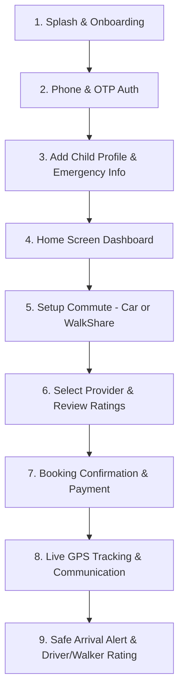
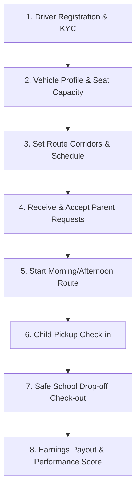
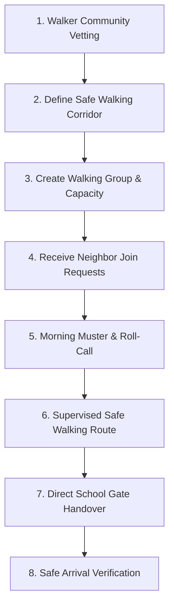

# Home2School — Ecosystem User Flows & Role Architecture
**Comprehensive Product Specification for Parent, Driver & Walker (WalkShare) Roles**

---

## 📌 Executive Summary

**Home2School** is a specialized child transportation platform engineered to eliminate parental anxiety, ensure institutional safety compliance, and provide flexible commute options for school children. The system operates on three interrelated core roles:

1. **👨‍👩‍👧 Parent (Customer & Guardian)**: Manages child profiles, configures commute rules, selects service types (Driver or Walker), tracks trips live via GPS, and receives safe-delivery confirmations.
2. **🚗 Driver (Vehicle Commute Provider)**: Fully vetted independent or fleet operators providing motorized car/van transportation for medium-to-long distance school commutes with seat management and multi-stop optimization.
3. **🚶‍♂️ Walker / WalkShare (Escorted Walking Bus)**: Community-based, vetted chaperones who guide groups of neighborhood children on foot for short-distance school commutes using designated safe corridors and zebra crossings.

---

## 📊 Comparative Architecture Matrix

| Capability & Dimension | 👨‍👩‍👧 Parent | 🚗 Driver (Vehicle Ride) | 🚶‍♂️ Walker (WalkShare) |
|---|---|---|---|
| **Primary Goal** | Book safe commute & live track children | Transport students via car/van & maximize seat utilization | Escort children safely on foot in neighborhood clusters |
| **Typical Commute Distance** | Any distance | 2.5 km – 20+ km | 400 m – 2.5 km |
| **Capacity per Route** | 1 to 4 children per booking | 4 to 12 seats (Sedan, SUV, Van) | 3 to 8 children per walking group |
| **Payment Flow** | Payer (Monthly recurring or per-trip) | Recipient (Mileage + Seat subscription) | Recipient (Flat per-child group fee) |
| **Key Safety Mechanisms** | SOS button, Geo-fencing, Real-time status chips | Speed alerts, Vehicle inspection KYC, Route deviation alerts | High-vis vests, Safe crossing checkpoints, School gate handover |
| **Environmental Impact** | Reduces individual parent school runs | Reduces school zone traffic via carpooling | Zero emissions, promotes healthy active lifestyle |

---

## 1. 👨‍👩‍👧 Parent User Flow & Feature Summary

### 🔹 Step-by-Step Experience:
1. **Onboarding & Authentication**:
   - 3-step value proposition onboarding (*Verified & Trusted Drivers*, *Real-time Live GPS*, *Stay Connected*).
   - Frictionless phone authentication with 4-digit auto-advancing OTP.
   - Guardian profile setup (Full Name, Relationship: Mother/Father/Guardian, Emergency Phone).

2. **Child Rider Management**:
   - Add single or multiple children with photo, school name, grade, dismissal time, and special needs.
   - Set preset home and school gate pickup coordinates.

3. **Trip Setup & Customization**:
   - **Service Switcher**: Select between **Vehicle Ride** or **WalkShare Escort**.
   - **Frequency**: One-time trip, Weekly series, or Monthly recurring pass (Mon–Fri).
   - **Legs**: Morning Drop-off only, Afternoon Return only, or Both-way commute.

4. **Provider Discovery & Trust Verification**:
   - Filter vetted drivers and walking chaperones by distance, rating, background checks, and pricing.
   - Detailed provider profile showing badge verification, vehicle details, police clearance, and parent reviews.

5. **Active Commute & Live Safety**:
   - Interactive live map showing driver/walker location in real-time.
   - Status triggers: `Provider on the way` ➔ `Child picked up` ➔ `In transit` ➔ `Arrived safely at school gate`.
   - In-app 1-tap call/message and Child Safety SOS button.

---

## 2. 🚗 Driver User Flow & Feature Summary

### 🔹 Step-by-Step Experience:
1. **Onboarding & Compliance (KYC)**:
   - Submission of Driving License, Vehicle Fitness Certificate, Commercial Insurance, and Police Background Check.
   - Verification review and activation of the "Home2School Pro Driver" badge.

2. **Vehicle & Route Configuration**:
   - Vehicle specifications (Make, Model, Year, Seat Capacity: e.g., 6 seats).
   - Define daily operating school zones and morning/afternoon pickup time windows.

3. **Request Management**:
   - Review incoming requests with child details, pickup address, school destination, and pricing.
   - Accept or propose slight time adjustment to optimize multi-stop route sequence.

4. **Trip Execution & Attendance Verification**:
   - Automated turn-by-turn navigation across pickup stops.
   - 1-tap "Child Boarded" confirmation to notify parents immediately.
   - Final "Arrived at School" gate confirmation.

5. **Financial & Rating Hub**:
   - Real-time earnings tracker (Daily, Weekly, Monthly).
   - Performance scorecard (Punctuality %, Parent Safety Rating, Feedback).

---

## 3. 🚶‍♂️ Walker / WalkShare User Flow & Feature Summary

### 🔹 Step-by-Step Experience:
1. **Neighborhood Chaperone Verification**:
   - Thorough identity and background verification for approved local community walkers.
   - First-aid certification and child escort safety guidelines review.

2. **Safe Walking Route Definition**:
   - Map out low-traffic, sidewalk-equipped walking paths and designated safe zebra crossings.
   - Set meetup muster points (e.g., neighborhood park or residential compound gate).

3. **WalkGroup Enrollment**:
   - Open slots for nearby neighborhood children attending the same school (typically 4–8 children).
   - Fixed departure times ensuring arrival 15 minutes prior to school bell.

4. **Escorted Morning & Afternoon Walk**:
   - Walker equips high-visibility safety vest and safety crossing paddle.
   - Digital roll-call check-in as each child joins the walking line.
   - Live location sharing active for all participating parents simultaneously.

5. **School Gate Handover**:
   - Direct physical handover to school duty staff or designated gate security.
   - App broadcasts batch "All Children Delivered Safely" alert to all parents.

---

## 📑 Quick Reference Summary

| Role | Key Screen / Views | Value Delivered |
|---|---|---|
| **Parent** | `home`, `bookingTripSetup`, `tracking`, `myChildren`, `messages`, `profile` | Total peace of mind, automated school commute, live tracking. |
| **Driver** | `driverHome`, `driverRequests`, `driverSchedule`, `driverActiveTrip`, `driverProfile` | Optimized student carpooling route, predictable recurring monthly revenue. |
| **Walker** | `walkerCorridorSetup`, `walkGroupRoster`, `liveWalkEscort`, `gateHandover` | Affordable eco-friendly community transit, safe supervised physical activity. |
